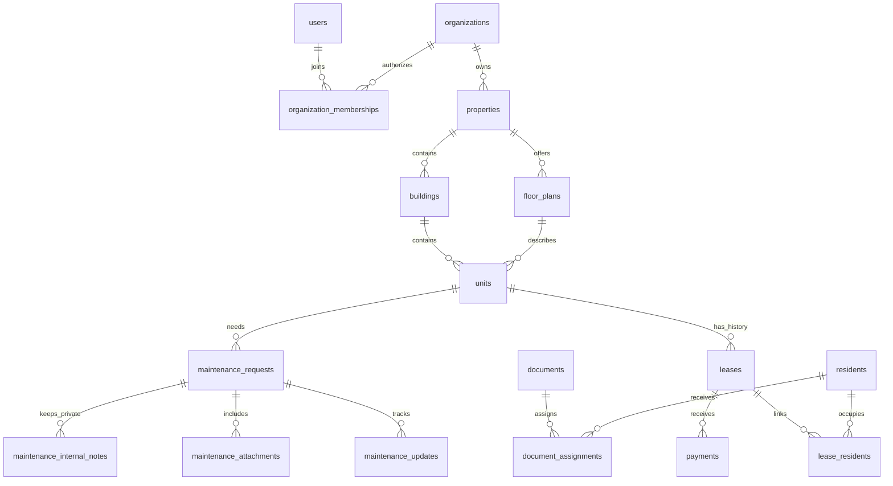

# Property Hub architecture

> Organization architecture update: see [TENANCY.md](TENANCY.md) for the current eight-migration schema, admin/leasing roles, separate platform super admins, live workspace sections, branding, and preserved-data migration. Older sections below describe the original demo foundation.

Property Hub is a reusable SaaS foundation with a separate fictional sales demonstration. It is ready for the next implementation pass; the full demo workflows have not been connected to a production Supabase project.

## Application boundaries

- **Public experience:** `/`, `/properties`, `/properties/[slug]`, `/availability`, `/how-it-works`, `/contact`, `/sign-in`, `/apply`, `/tour`. Listings currently show the three explicitly fictional demo communities.
- **Demo experience:** `/demo` is the guided launcher; `/demo/[persona]/[[...section]]` contains the role-specific workspaces. The five allowed personas and their valid navigation sections are defined centrally. Invalid personas and sections return 404.
- **Production experience:** `/workspace` and `/workspace/[organizationId]`. These validate a Supabase Auth user on the server, fetch that user's memberships, and scope property queries to an authorized organization. These routes explicitly use dynamic rendering. They never import demo data or trust demo state.
- **Authentication:** Supabase SSR browser/server helpers, a session refresh proxy, password sign-in action, sign-out action, and reusable `requireUser` / `requireMembership` guards. Role decisions come from database membership rows, never user-editable JWT metadata.
- **Demo state:** validated, versioned, tab-scoped session storage. It contains fictional changes only. The selected persona is in the URL; changing it neither issues a JWT nor changes a membership. Refresh preserves a demonstration. Reset restores fixtures and keeps only a timestamp used to hide earlier website inquiries in that tab’s demo views.

The public and demo screens work without environment variables. When Supabase is unconfigured, production sign-in is clearly unavailable. Adding a project requires a new build with its public environment variables.

## Public leasing persistence

The public leasing pass adds `leasing_intakes`, bringing that pass to 21 tables; the current schema contains **23 tables**. It has composite tenant/property/unit/plan foreign keys, RLS, timestamps, linked lead/tour IDs, and a unique organization/session/request key. Inquiries collect only contact and move preferences; they never create screened rental applications. Guest tours permit nullable `user_id` and `unit_id` while preserving the original authenticated policies.

The `/api/leasing` Node route validates a strict Zod payload, the published fictional community, the selected unit/floor plan, move-in dates, tour dates, and request origin. It ignores no unknown tenant fields: they are rejected. The server supplies the organization and browser session. The `submit_leasing_intake` invoker-rights RPC is executable only by the server role, atomically creates the lead/tour and intake, serializes retries per session, checks current publication/availability/provider settings, and applies a 20-request/hour/session quota. There is no anonymous table or RPC grant.

A local PGlite adapter runs the same schema and RPC with persistent filesystem storage. A Supabase adapter can use a dedicated seeded demo project. Vercel cannot fall back to ephemeral disk. These adapters are separate from the authenticated production workspace. Before live customer intake, replace the fixed demo catalog with a minimal published inventory projection and verify tenant domain resolution, rate limiting, retention, and real Auth/PostgREST integration. See [PUBLIC-LEASING.md](PUBLIC-LEASING.md).

The operational demo uses sessionStorage; the public leasing inbox uses the database and a seven-day browser cookie. Reset clears operational tab state and its referenced local attachments, retaining a `demoResetAt` cutoff. The shared leasing hook excludes older inquiries from that tab’s demo presentation. Public requests remain in the database, another tab retains its own view and operational state, and another browser session cannot read those requests. New inquiries after the cutoff appear normally. No confirmation messages are sent.

## Guided sales demonstration

`src/lib/demo/story.ts` defines the fictional Sofia applicant, Alex resident, available Mercer B-302 two-bedroom, Marcus maintenance identity, linked lead ID, and nine completion conditions. Completion comes from shared application/tour/request/assignment/status state plus visits to the manager, resident-update, and owner screens. Hiding hints does not disable progress tracking. Reset restores all milestones to their initial state.

The launcher and reusable controls in `src/components/demo` use this shared definition. Applicant apartment cards stay in demo routes and carry the selected available unit into the tour and application. Management selectors derive the linked applicant lead and submitted application from the same state; the Leads screen exposes the requested tour. The resident request form can load an illustrative local image through the existing attachment provider. Maintenance defaults to Marcus’s assignments, with an explicit team queue option. Existing shared selectors and activity recording propagate each handoff into resident timelines and portfolio metrics.

These are presentation workflows over fictional data. Their role capabilities do not replace authenticated server guards or RLS. The sales pass adds no database schema, grants, credentials, memberships, or production authorization exceptions. See [SALES-DEMO.md](SALES-DEMO.md) for the presentation sequence and reset boundary.

## Resident application

The resident persona uses a dedicated mobile-first shell with five primary bottom-navigation destinations, eight sections, a nested payment review, a new-repair form, and request detail routes. The existing global persona switcher remains available. Forms wait for tab state to hydrate before accepting input. Shared maintenance components let managers post status and schedule updates that appear with author names on the resident timeline. Contact messages appear in the same tab’s management Residents inbox.

Receipts and operational data use the validated demo store; photo/video blobs use an IndexedDB attachment provider. Neither is production authorization. The payment provider separates simulation receipts from future hosted checkout results; only the simulator is enabled in demo mode. Actual ledger writes remain server controlled. See [RESIDENT-EXPERIENCE.md](RESIDENT-EXPERIENCE.md) for routes, walkthrough, storage limits, and next integrations.

Two additive resident migrations extend the existing 21-table schema with scheduling, access, timeline, video metadata, renewal, and contact preferences. A profile trigger enforces the resident column boundary because row policies alone do not restrict manager-granted column privileges. Residents cannot change identity/linkage, another resident’s preferences, maintenance status, confirmed schedules, or management timeline events.

## Management application

Owner and Property Manager share modular inventory, resident, leasing, maintenance, document, announcement, and activity components. The owner landing page emphasizes portfolio performance; the manager landing page also highlights operational priorities. Ten metrics and all chart values are calculated from shared records, with property scoping and links into relevant records. Nested property and resident routes validate record IDs and permitted sections on the server.

Operational changes are validated demo tab state. Central activity recording captures application/tour submissions, maintenance submissions and updates, simulated payments, announcements, and CRM/application stage changes. Public leasing activity is also stored by a PostgreSQL trigger on intake creation, preserving retry idempotency. No activity event contains private maintenance notes.

`maintenance_internal_notes` keeps team notes separate from resident-visible `maintenance_updates`. `document_assignments` supplies a single revocable recipient relationship; a compatibility migration preserves old recipients without inventing authorship. Building-level announcements and documents require a building within the selected tenant/property. Documents default to staff visibility. Resident selectors mirror these audiences in the fictional demo, while actual PostgreSQL RLS enforces them for real users. Presentation capability maps grant no authorization.

Maintenance navigation excludes financial, application, resident-directory and document-library tools. Staff is a supported database role with operational reads and no financial access or manager writes; the sales switcher retains the requested five personas. Live authenticated workflow screens and a full staff workspace remain part of production integration. See [management implementation notes](MANAGEMENT-EXPERIENCE.md).

## Database

The initial migration creates 20 tables:

`organizations`, `users`, `organization_memberships`, `properties`, `buildings`, `floor_plans`, `units`, `residents`, `leases`, `lease_residents`, `applications`, `leads`, `maintenance_requests`, `maintenance_attachments`, `maintenance_updates`, `documents`, `announcements`, `payments`, `tour_requests`, and `activity_events`.

Every table has a UUID primary key, `created_at`, and `updated_at`. The root organization table identifies the tenant. The `users` table is a global identity profile keyed to `auth.users`; organization access comes exclusively from memberships. Every other table includes `organization_id`.

Composite foreign keys pair parent IDs with organization IDs. Units additionally pair property IDs with their buildings and floor plans. Payments must link a resident actually attached to their lease. Every foreign key has a supporting index; there are additional indexes for availability, membership lookup, maintenance queues, lease expiration, payment periods, and recent activity.

Tenant IDs, record IDs, and creation timestamps are immutable after insertion. Deferred occupancy constraints run at transaction commit: occupied units require exactly one active lease, active leases require at least one linked resident, and available or turnover units cannot have active leases. A partial unique index prevents concurrent active leases on one unit. Lease and occupancy changes must be made atomically by a future transactional workflow. Monetary amounts use integer cents; dates and transaction status combinations have checks.

## Access policy

All public tables have RLS enabled and explicit grants. Anonymous clients receive no relational table access. A future production listing endpoint must expose a minimal, deliberately reviewed listing projection; never grant anonymous access to resident, lease, application, or payment data.

| Role             | Foundation database access                                                                                                                                                                            |
| ---------------- | ----------------------------------------------------------------------------------------------------------------------------------------------------------------------------------------------------- |
| Owner            | Organization-scoped operational reads and management writes; own organization name; financial reads                                                                                                   |
| Property manager | Organization-scoped operational reads and management writes; financial reads                                                                                                                          |
| Staff            | Organization-scoped operational reads; no payment access or management writes                                                                                                                         |
| Maintenance      | Organization inventory and requests; status and assignment updates; visible request updates/attachment metadata; published announcements; no resident directory, applications, or finances            |
| Resident         | Own profile, linked leases, own unit, own payments and requests; own/private and applicable community documents; published community announcements; may submit a request for their occupied apartment |
| Applicant        | Published organization properties and available units, own applications and tours; may submit drafts/request tours; cannot approve applications                                                       |
| Platform admin   | A reserved, organization-scoped membership role with no implicit tenant-data bypass; platform support tooling is a future audited workflow                                                            |

Membership provisioning, payment writes, and activity-event writes are not granted to authenticated browser clients. They require a trusted server workflow. The optional dedicated Supabase demo intake adapter uses a server-only secret key. Its repository is fixed to the fictional organization, while browser reads are additionally scoped to an HttpOnly session cookie. No browser client receives that key. Maintenance ownership fields are protected by column-level update grants. Applicants cannot escalate application status to approved, and organization IDs cannot be changed during updates.

Private authorization helpers intentionally use security-definer membership lookups to avoid recursive membership RLS. They live in the unexposed `private` schema, have empty search paths, check the current authenticated user, and have explicit execution grants. Occupancy enforcement is a non-callable trigger function. No security-definer helper accepts an identity to impersonate.

## Demo dataset

The fixed demonstration date is September 17, 2026. The fictional organization is **Alder & Stone Living**. The Mercer, Juniper Park, and Westhaven Lofts each contain 30 units: 26 occupied, three available October 1, and one in turnover. There are six buildings and nine floor plans, including studios, one-bedroom, and two-bedroom homes.

The data contains 78 residents, 78 active leases, 78 resident/lease links, 235 simulated payment records (July–September history plus Alex’s October charge), eight leads, six applications, twelve maintenance requests, twelve updates, six announcements, six document metadata records, one document assignment, three tours, and four initial activity events. September has 70 paid, four pending, and four overdue rent records. All occupied apartments have a corresponding resident and lease. Available and turnover units have neither active leases nor attached active residents.

The browser fixtures and SQL seed come from the same deterministic dataset. The seed is repeatable and does not create passwords or usable demo sign-in sessions. The attachment table is ready, but no nonexistent uploaded attachment is seeded. Resident downloads contain metadata only, without legal or policy terms. No signed agreement or legal document is generated.

## Verification scope

`pnpm db:test` applies the actual SQL migration and seed twice to an isolated PGlite PostgreSQL engine. It creates a second organization and executes statements under authenticated, anonymous, owner, manager, maintenance, resident, applicant, and platform-admin identities. PostgreSQL executes the real policies and constraints. Supabase's `auth.uid()` integration is emulated with a per-session identity setting; this is **not** a hosted Supabase Auth, PostgREST, or Storage integration test.

Playwright covers all 51 public/demo navigation routes, empty/search/filter states, five persona changes, production-route denial, resident→maintenance→resident updates, applicant→manager submission, tours, announcements, document downloads, mobile overflow, mobile navigation, and automated WCAG A/AA checks on the original eight key mobile routes and every resident screen. The expanded browser suite includes payment receipts, profile persistence, management contact review, photo/video reloads, and attachment cleanup. Resident widths are checked at 390, 768, and 1440 pixels. Automated accessibility tests supplement, rather than replace, human screen-reader testing.

## PWA and hosting

The App Router app is compatible with Vercel's Next.js deployment. It includes a manifest, SVG and raster icons, theme/viewport metadata, and standalone display settings. A service worker is deliberately deferred: offline caching of authenticated organization data needs an explicit privacy, invalidation, and logout strategy. This is PWA-ready scaffolding, not a completed offline application. Local fonts and illustration photography are bundled, so rendering does not depend on a third-party font or image host at runtime.

No hosted Supabase project or Vercel deployment was created or modified in this implementation.

## Next implementation pass

1. Connect a dedicated Supabase development project, apply the migration, run Supabase advisors, and verify Auth/PostgREST/Storage behavior with two organizations. Provision real accounts and memberships through a trusted onboarding/invitation flow.
2. Connect the demonstrated workflows to typed, server-validated queries and transactional mutations. Add organization switching to the full production shells and audit role-specific navigation against server permissions.
3. Add real property/unit/resident editing and atomic lease creation, renewal, transfer, and termination workflows. Extend availability to future move-outs and date-based inventory.
4. Add application drafts, screening/consent, approval workflows, tour availability and scheduling, and contact delivery. Choose providers and establish explicit consent before sending messages or running screening.
5. Connect a payment provider, idempotent verified webhooks, ledger reconciliation, refunds, and payment methods. Keep payment records server-controlled.
6. Add private Supabase Storage buckets, metadata-first object authorization, short-lived signed downloads, upload validation, and document/attachment lifecycle rules. Connect real notification delivery and trusted activity recording for production mutations; the demo and public intake already record their activity.
7. Add monitoring, rate limiting for externally exposed write endpoints, account recovery, production security review, retention controls, and deployment configuration. Complete service-worker behavior, installation UX, and offline boundaries only after data handling is defined.

## Reference documentation

- [Next.js App Router](https://nextjs.org/docs/app) and the version-matched documentation installed with Next.js.
- [Supabase SSR clients and session refresh](https://supabase.com/docs/guides/auth/server-side/creating-a-client).
- [Supabase Row Level Security](https://supabase.com/docs/guides/database/postgres/row-level-security).
- [shadcn/ui installation](https://ui.shadcn.com/docs/installation).
